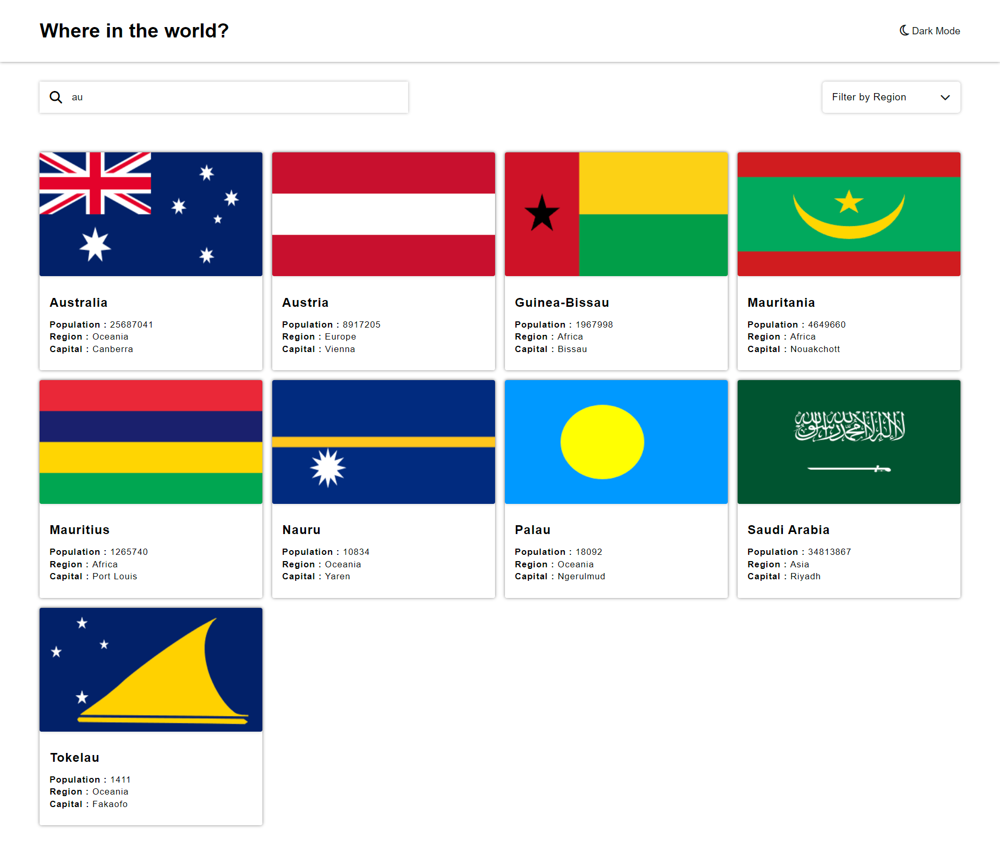

# Frontend Mentor - REST Countries API with color theme switcher solution

This is a solution to the [REST Countries API with color theme switcher challenge on Frontend Mentor](https://www.frontendmentor.io/challenges/rest-countries-api-with-color-theme-switcher-5cacc469fec04111f7b848ca). Frontend Mentor challenges help you improve your coding skills by building realistic projects.

## Table of contents

- [Overview](#overview)
  - [The challenge](#the-challenge)
  - [Screenshot](#screenshot)
  - [Links](#links)
- [My process](#my-process)
  - [Built with](#built-with)
  - [What I learned](#what-i-learned)
  - [Useful resources](#useful-resources)
- [Author](#author)

## Overview

### The challenge

Users should be able to:

- See all countries from the API on the homepage
- Search for a country using an `input` field
- Filter countries by region
- Click on a country to see more detailed information on a separate page
- Click through to the border countries on the detail page
- Toggle the color scheme between light and dark mode _(optional)_

### Screenshot

### Links

- Solution URL: [Add solution URL here](https://github.com/Psargar616/rest-countries-api-with-color-theme-switcher)
- Live Site URL: [Add live site URL here](https://your-live-site-url.com)

## My process

### Built with

- Semantic HTML5 markup
- CSS custom properties
- Flexbox
- CSS Grid
- JavaScript

### What I learned

- While making this project, the most important thing which I learned is the fetch API which is also the foundation of this website.

- One other thing which I also learned how to change theme (light/dark).

### Useful resources

- [Stack Overflow](https://stackoverflow.com/) - As always, when I got stuck, stackoverflow helped me get through.
- [W3School](https://www.w3schools.com/) - this is the best website for documentation with easily understandable code examples.

## Author

- Frontend Mentor - [@Psargar616](https://www.frontendmentor.io/profile/Psargar616)
